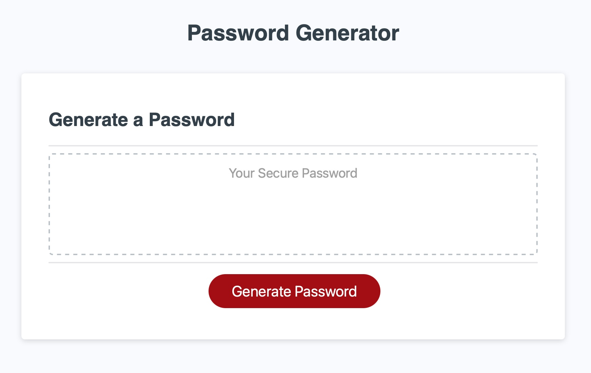
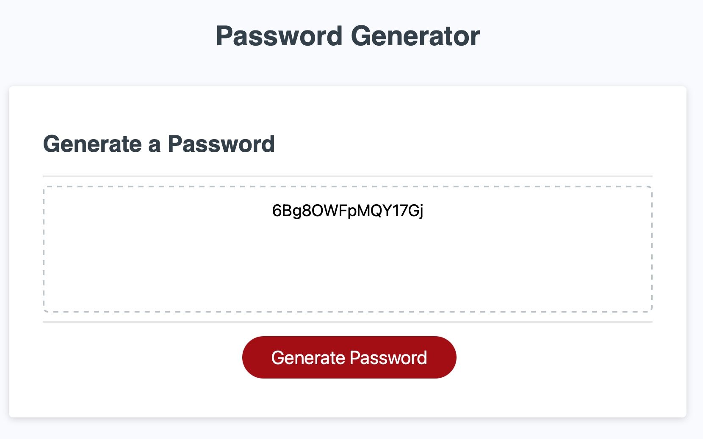

# password-generator

## Javascript to generate password

- Understand use of javascript 
- Understand DOM in javascript 
- Click button to generate password based on user input
- Choice of whether or not to include lowercase, uppercase, numeric, and/or special characters
- The user choice to match atleast one character type

## Table of Contents
Below are steps I had to follow to setup this project
- [Installation](#installation)
- [Usage](#usage)
- [Credits](#credits)
- [License](#license)

## Installation
The initial source was a file repostiory containg the a folder with html page, css and images folders.
* Created a new git repository, follow the documented [steps](GITHUB_SETUP.md)
* To clone this repository
  * Make sure you have right access to pull in the reposotiory either by applying 'ssh' keys or by providing a username and password'
  * Make sure your path is proper
  * Copy the git command to where you want to clone the repository
   ```
    git clone git@github.com:kumarakom/password-generator.git
   ```
  * You will see a `password-generator` folder
* An alternate document to clone a repo can also be found at [github](https://docs.github.com/en/github/creating-cloning-and-archiving-repositories/cloning-a-repository-from-github/cloning-a-repository)


## Usage

1. To contribute to this page, please follow steps on [contributing](CONTRIBUTING.md)
2. To generate a password, click on 
3. Fullfill the questions on password 
   - length 
   - use of uppercase characters
   - use of lowercase characters
   - use of numeric characters
   - use of special characters 


## Credits

Key areas that helped me with Javascript were:

- [Logical and comparison operators](https://developer.mozilla.org/en-US/docs/Web/JavaScript/Guide/Expressions_and_Operators)
- [Conditional statements](https://developer.mozilla.org/en-US/docs/Web/JavaScript/Reference/Statements/if...else)
- [Arrays](https://developer.mozilla.org/en-US/docs/Web/JavaScript/Reference/Global_Objects/Array)
- [DOM](https://developer.mozilla.org/en-US/docs/Web/API/Document_Object_Model)

## License

This page is provided as is and originally belongs to
```
© 2021 Trilogy Education Services,
LLC, a 2U, Inc. brand.
Confidential and Proprietary. All Rights Reserved.
```
